**BÁO CÁO**

**AN TOÀN ĐIỆN TOÁN ĐÁM MÂY**

> **Sinh viên thực hiện:**
>
> **NGUYỄN VĂN HIỆP**
>
> **PHẠM PHÚ QUÍ**
>
> **ĐOÀN THẾ HẠNH**
>
> **ĐỖ HUY THẮNG**
>
> **Lớp: AT13M**

*Thành phố Hồ Chí Minh, tháng 12 năm 2020*

**Yêu cầu 1: Xây dựng một database**

Truy cập trang: <https://my.vertabelo.com/>

Click sign up

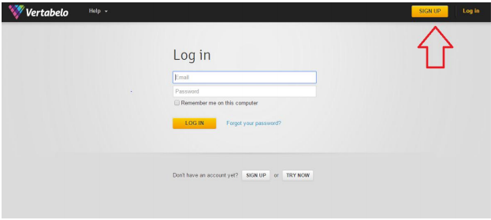

Điền thông tin -\> create account

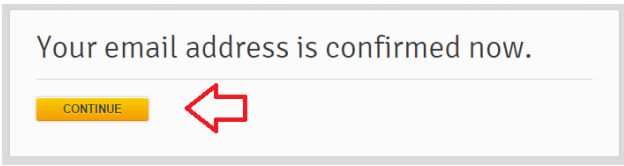

Chọn chế độ

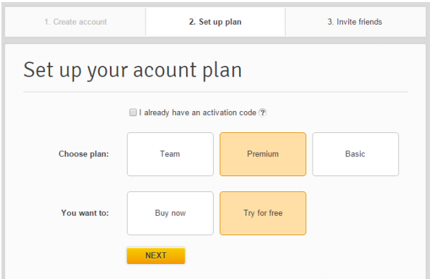

Hoàn tất

Click create new model để tạo database

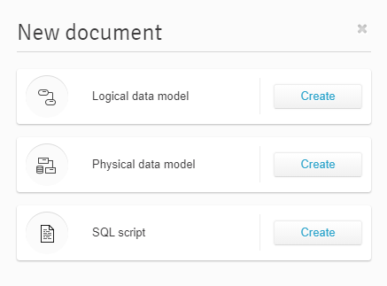{width="2.9877449693788276in"
height="2.2083333333333335in"}

Đặt tên, cấu hình cho database -\> start modeling

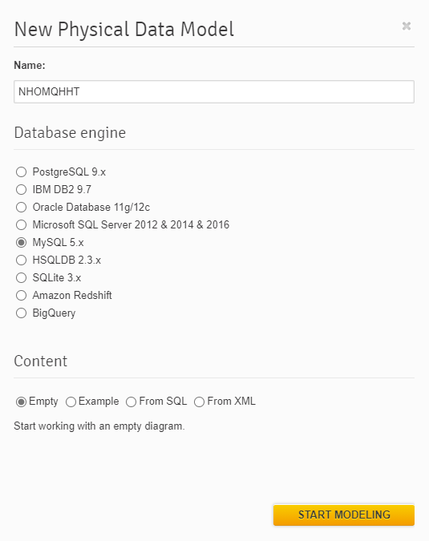{width="5.573694225721785in"
height="7.032230971128609in"}

Hoàn thành: giao diện chính

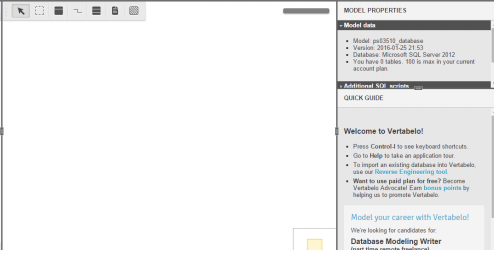{width="5.146551837270342in"
height="2.635784120734908in"}

Tiến hành tạo bảng :

Click add table

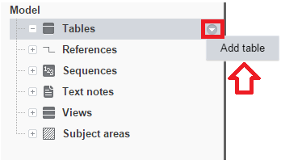{width="3.6255063429571304in"
height="2.1148786089238847in"}

Hoàn tất

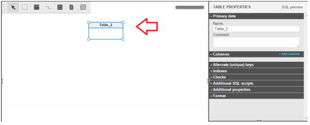

Click vào bên phải để đặt tên và thêm cột cho bảng

Đặt tên bảng

Click vào + add column để thêm cột cho bảng

Click PK để đặt khóa chính cho bảng, click N để cho phép cột được NULL

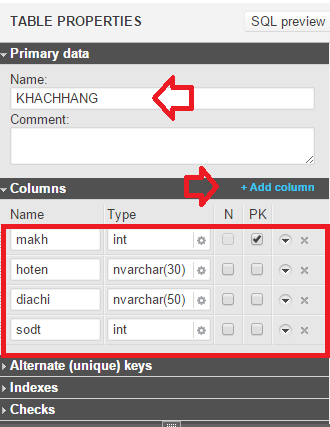{width="3.43798009623797in"
height="4.448537839020123in"}

Tạo quan hệ :

Click references và click biểu tượng trên thanh công cụ

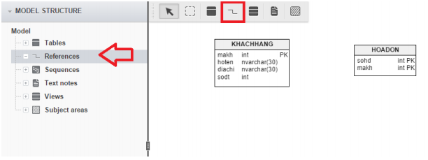

Click chuột vào bảng KHACHHANG và rê chuột sang bảng HOADON

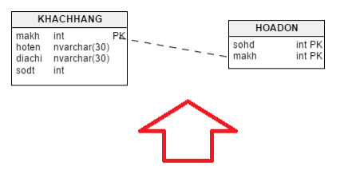{width="4.594390857392826in"
height="2.3232403762029747in"}

Click vào sợi quan hệ để chỉnh sửa quan hệ

Xóa dòng KHACHHANG_makh được tự tạo

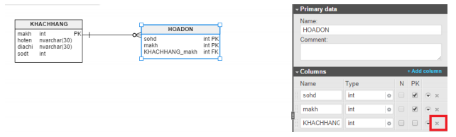

Click vào dây quan hệ để tạo quan hệ mới

Chọn makh ở 2 bảng -\> add

Làm tương tự cho các bảng còn lại

Hoàn thành:

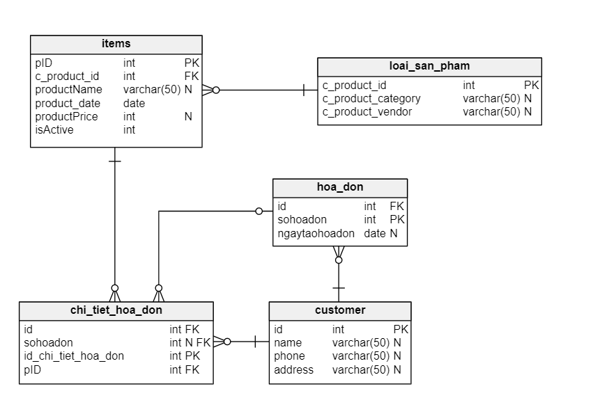

Xuất database vừa tạo

Click vào biều tượng SQL -\> generate -\> download

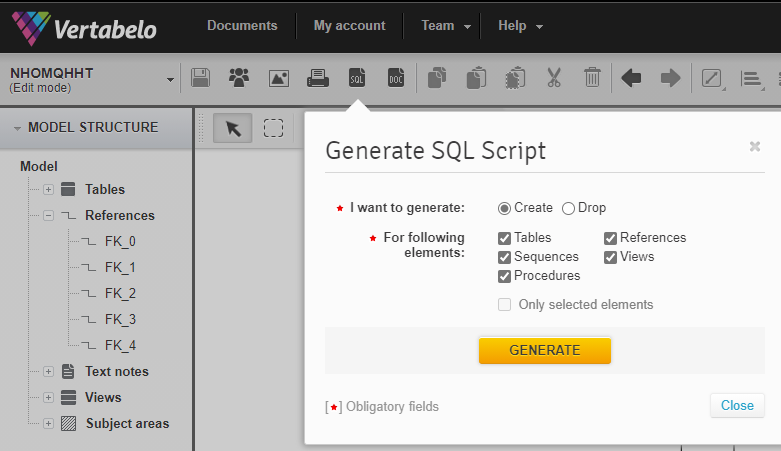

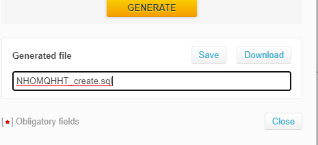{width="4.844425853018373in"
height="2.2086417322834646in"}**\
**Mở file vừa download lên bằng MySQL WorkBench 8.0 CE

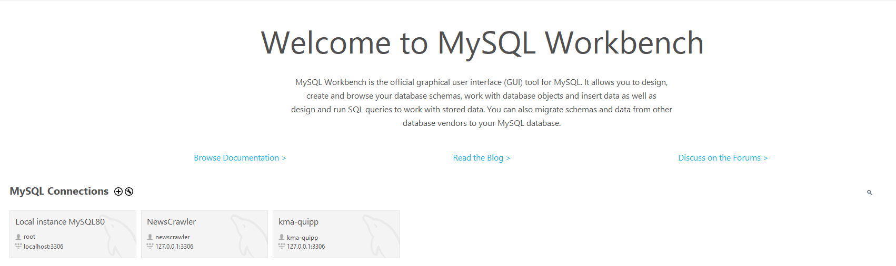

Chúng ta sẽ có đoạn script để tạo database đã thao tác trên vertabelo

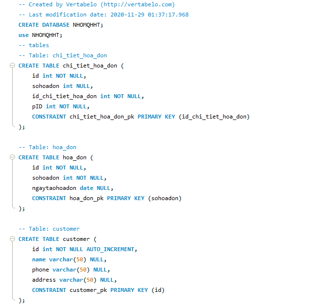

Thêm

CREATE DATABASE NHOMQHHT;

Use NHOMQHHT

Ctrl + Shift + Enter -\> đã tạo thành công database

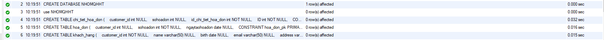

Tiến hành nhập dữ liệu cho databse :

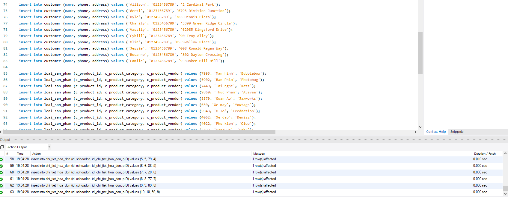

KIỂM TRA:

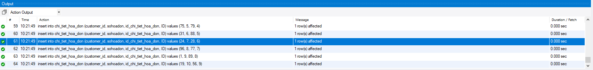

{width="4.938188976377953in"
height="1.6460629921259842in"}

**Yêu cầu 2. Xây dựng 1 ứng dụng web kết nối với database**\
Ứng dụng NodeJS -- MySQL

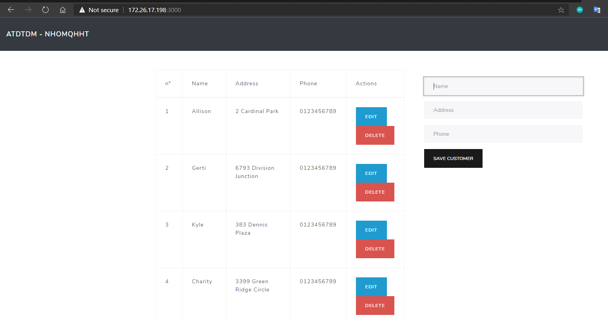

Code:

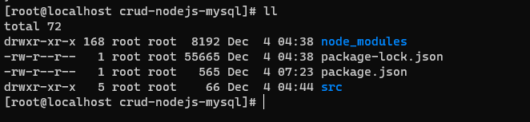

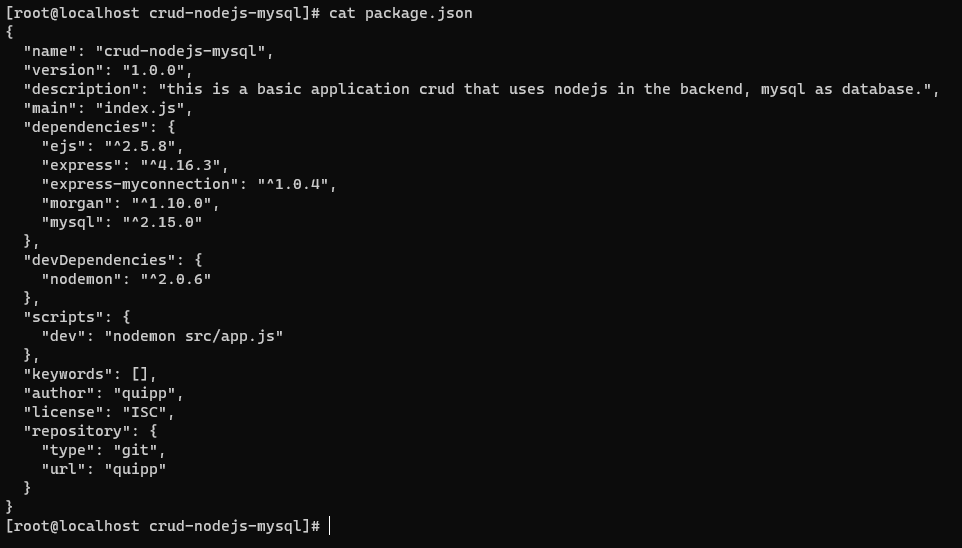

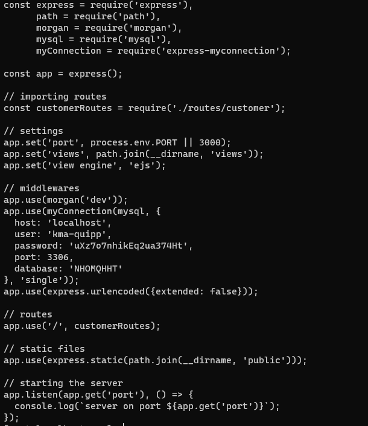

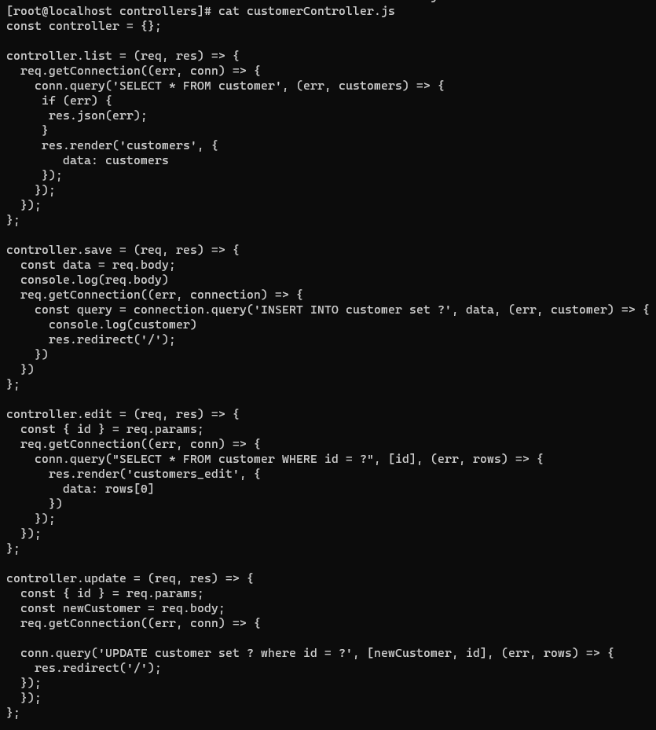

Giao diện web

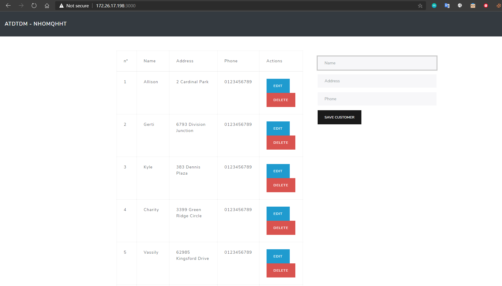

**Yêu cầu 3: Up Code lên github:**

Tạo Repository

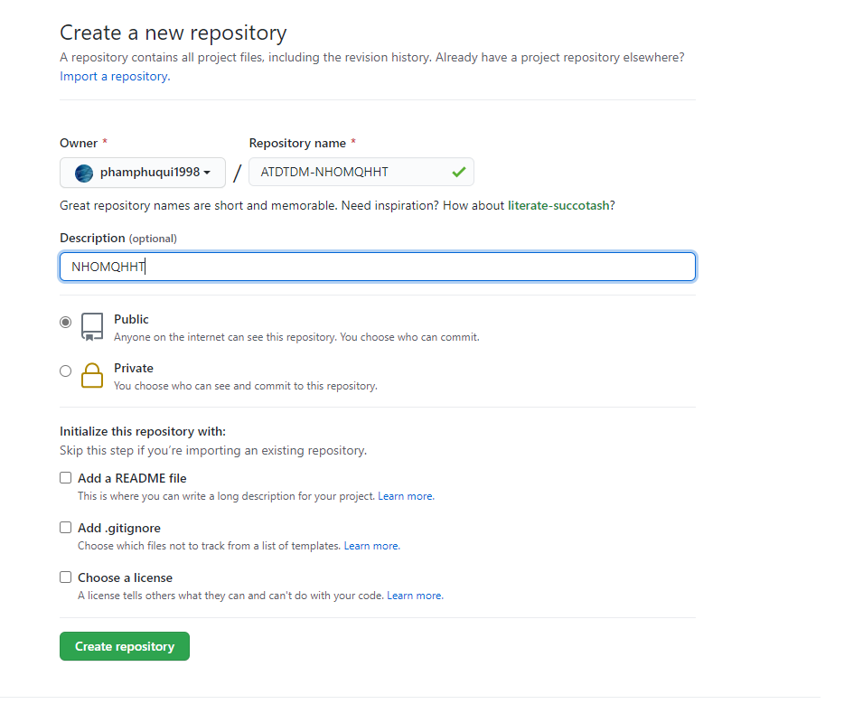

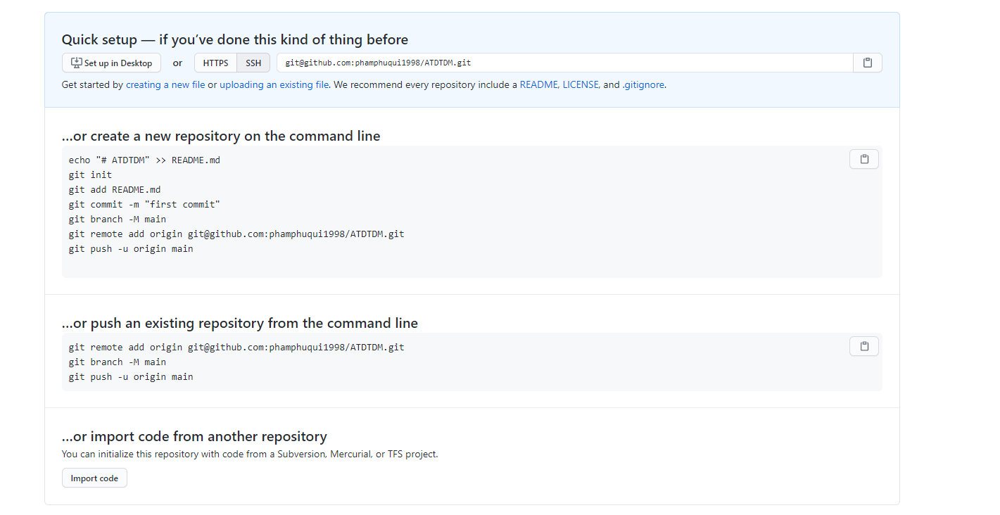

Khởi tạo git:

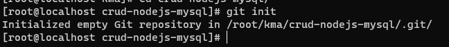

Add remote repo:

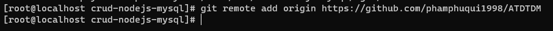

Add các file có trong thư mục chuẩn bị đẩy lên git:

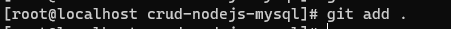{width="4.698572834645669in"
height="0.3021259842519685in"}

Đưa message để ghi chú commit:

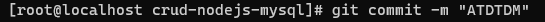{width="5.677876202974629in"
height="0.22919838145231847in"}

Push code lên git:

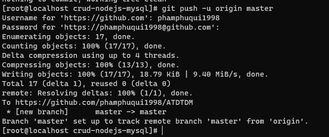

Kiểm tra

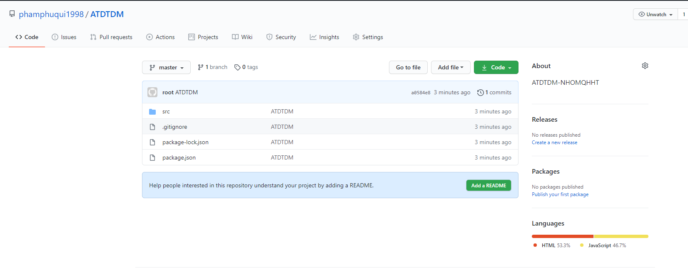
