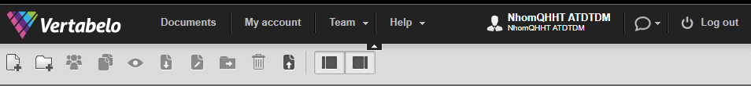
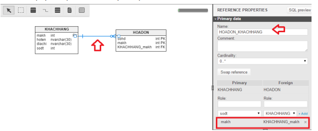
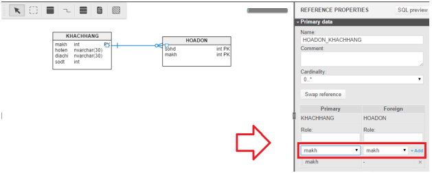
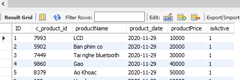

**BÁO CÁO**

**AN TOÀN ĐIỆN TOÁN ĐÁM MÂY**

> **Sinh viên thực hiện:**
>
> **NGUYỄN VĂN HIỆP**
>
> **PHẠM PHÚ QUÍ**
>
> **ĐOÀN THẾ HẠNH**
>
> **ĐỖ HUY THẮNG**
>
> **Lớp: AT13M**

*Thành phố Hồ Chí Minh, tháng 12 năm 2020*

----

[1. Xây dựng một database](#1)
[2. Xây dựng 1 ứng dụng web kết nối với database](#2)
[3. Up Code lên github](#3)

----

**Yêu cầu 1: Xây dựng một database**

Truy cập trang: <https://my.vertabelo.com/>

Click sign up

Điền thông tin -\> create account

Chọn chế độ

Hoàn tất

Click create new model để tạo database

Đặt tên, cấu hình cho database -\> start modeling

Hoàn thành: giao diện chính

Tiến hành tạo bảng :

Click add table

Hoàn tất

Click vào bên phải để đặt tên và thêm cột cho bảng

Đặt tên bảng

Click vào + add column để thêm cột cho bảng

Click PK để đặt khóa chính cho bảng, click N để cho phép cột được NULL

Tạo quan hệ :

Click references và click biểu tượng trên thanh công cụ

Click chuột vào bảng KHACHHANG và rê chuột sang bảng HOADON

Click vào sợi quan hệ để chỉnh sửa quan hệ

Xóa dòng KHACHHANG_makh được tự tạo

Click vào dây quan hệ để tạo quan hệ mới

Chọn makh ở 2 bảng -\> add

Làm tương tự cho các bảng còn lại

Hoàn thành:

Xuất database vừa tạo

Click vào biều tượng SQL -\> generate -\> download

Mở file vừa download lên bằng MySQL WorkBench 8.0 CE

Chúng ta sẽ có đoạn script để tạo database đã thao tác trên vertabelo

Thêm

CREATE DATABASE NHOMQHHT;

Use NHOMQHHT

Ctrl + Shift + Enter -\> đã tạo thành công database

Tiến hành nhập dữ liệu cho databse :

KIỂM TRA:

**Yêu cầu 2. Xây dựng 1 ứng dụng web kết nối với database**\
Ứng dụng NodeJS -- MySQL

Code:

Giao diện web

**Yêu cầu 3: Up Code lên github:**

Tạo Repository

Khởi tạo git:

Add remote repo:

Add các file có trong thư mục chuẩn bị đẩy lên git:

Đưa message để ghi chú commit:

Push code lên git:

Kiểm tra

